# SamAI SDK

[](https://www.npmjs.com/package/samai-sdk)
[](https://github.com/Sameer9823/samai-sdk/blob/master/LICENSE)
[](https://samai-sdk.vercel.app/)

`samai-sdk` — a unified AI agent SDK covering **OpenAI**, **Anthropic (Claude)**, and **Google Gemini** — one API, swappable providers, with a real agent runtime, guardrails, tool calling, MCP (Model Context Protocol) client support, web search, and Redis/SQLite-backed sessions built in as first-class citizens instead of bolted on.

```bash
npx samai-sdk create my-agent --provider anthropic && cd my-agent && npm install
```

## Table of contents

- [Why this exists](#why-this-exists)
- [How it compares](#how-it-compares)
- [Status](#status) · [Architecture](#architecture)
- [Roadmap](#roadmap)
- [Feature reference](#feature-reference) — jump straight to any API
- [Agents: defineAgent(), handoffs, sessions, tracing](#agents-defineagent-handoffs-sessions-and-tracing)
- [Documentation](#documentation) · [Install](#install) · [Quick start](#quick-start) · [Providers](#providers)
- [Web search](#web-search) · [MCP](#mcp-model-context-protocol) · [Sandboxed code execution](#sandboxed-code-execution) · [Voice / realtime](#voice--realtime-agents) · [RAG](#rag--vector-search)
- [Guardrails](#guardrails) · [Structured output](#structured-output-with-generateobject) · [Retries/fallback/timeouts](#retries-and-fallback-chains)
- [Testing](#testing-your-agents) · [Observability](#observability-tracing-opentelemetry-and-a-local-trace-viewer) · [Error handling](#error-handling)
- [Project layout](#project-layout) · [CLI](#cli) · [Publishing](#publishing-to-npm)

## Why developers choose samai-sdk

Five reasons teams pick `samai-sdk` over the alternative of hand-rolling an agent loop, or adopting a heavier framework:

**1. You're not betting on one model vendor.** Eight providers behind one `Provider` interface — Anthropic, OpenAI, Gemini, Groq, Mistral, Ollama, Azure OpenAI, Bedrock. Swap `anthropic({...})` for `openai({...})` and nothing else in your agent, tools, guardrails, or tracing changes. If your vendor changes pricing, rate-limits you, or ships a worse model, switching is a one-line change — not a rewrite.

**2. Safety is the default, not a checkbox you forget.** Approval-gated tools **fail closed** if you forget to wire up a handler — a risky tool literally cannot run unattended by accident. Guardrails throw typed errors with the reason attached instead of silently degrading. Every run produces a full trace whether you asked for it or not. Most teams bolt this on after an incident; here it's already on.

**3. It's small enough to actually read.** The entire runtime is under 2,500 lines of TypeScript. When something behaves unexpectedly at 2am, reading `run.ts` is a 10-minute task — not an afternoon spent spelunking through a framework's abstraction layers. That's a real velocity difference for a team that has to *own* what's in production.

**4. It has the features other "minimal" SDKs make you build yourself.** MCP client, sandboxed code execution, voice/realtime sessions, resumable/checkpointed runs, multi-agent handoffs with loop prevention, four session store backends, OpenTelemetry export, a local trace viewer — these are usually the reasons teams graduate to a heavyweight framework. Here they come with the "thin" SDK.

**5. No lock-in, ever, by construction.** The agent runtime is written against `generate()`/`stream()` and never imports a vendor SDK directly. There's no proprietary state format, no hosted-only tracing, no platform you have to deploy through. Everything — sessions, checkpoints, traces — is data you own, in stores you control (file, Redis, SQLite, or your own).

### Head-to-head: what you get without extra work

| If you need this in production... | Hand-rolled loop | Thin provider wrapper (Vercel AI SDK) | Heavy framework (LangChain.js) | `samai-sdk` |
|---|---|---|---|---|
| Swap model providers without a rewrite | Rebuild the loop | Change one import, usually | Change an integration package | Change one line |
| Stop a risky tool call without a human present | You build this | You build this | You build this | Built in, fails closed |
| See exactly what an agent run did, after the fact | You build this | Partial via telemetry hooks | External service (LangSmith) | Built in, every run, no signup |
| Delegate a task to a specialist agent safely | You build loop-prevention yourself | You build this | Graph setup required | One `handoffs: [...]` array |
| Resume a run after a crash without redoing tool calls | You build this | You build this | Available via LangGraph persistence | Built in, two functions |
| Read the whole thing in an afternoon | N/A — you wrote it | Maybe, if you stay in scope | Unlikely | Yes — under 2,500 lines |

## Feature reference

A fast lookup table — find the function you need, see what it does and where to read more, without scrolling the whole README.

| Need | Function / export | One-liner | Docs |
|---|---|---|---|
| Call any model provider | `createClient()` | Wraps a `Provider` with input/output guardrail middleware | [Providers](#providers) |
| Swap providers | `openai()` `anthropic()` `google()` `groq()` `mistral()` `ollama()` `azureOpenAI()` `bedrock()` | Same `Provider` interface across all eight | [Providers](#providers) |
| Define a tool | `defineTool()` | Name + zod/Standard Schema params + `execute()` | [Quick start](#quick-start) |
| Build an agent | `defineAgent()` | Bundles instructions, model, tools, handoffs, guardrails, output schema | [Agents](#agents-defineagent-handoffs-sessions-and-tracing) |
| Run an agent | `runAgent()` / `runAgentStream()` | Full agent loop with tool execution, handoffs, tracing | [Agents](#agents-defineagent-handoffs-sessions-and-tracing) |
| Delegate between agents | `handoffs` on `defineAgent()` | Loop-safe multi-agent delegation (`maxHandoffs` cap) | [Handoffs](#handoffs-and-loop-prevention) |
| Persist conversation memory | `createSession()` + `*SessionStore` | In-memory, file, Redis, or SQLite backing stores | [Sessions](#sessions-memory) |
| Block/rewrite input or output | `createPiiInputGuardrail()` etc. | PII, prompt-injection, blocklist, schema, budget guardrails | [Guardrails](#guardrails) |
| Block a dangerous tool call | `createDangerousToolGuardrail()` | Runs before tool execution, blocks by name/args | [Tool guardrails](#tool-guardrails-and-approval) |
| Require human sign-off | `requiresApproval` + `onApprovalRequest` | Fails closed if no approval handler is wired up | [Approval](#tool-guardrails-and-approval) |
| Get typed JSON out | `generateObject()` / `streamObject()` | Schema-validated output with auto-repair retries | [Structured output](#structured-output-with-generateobject) |
| Classify/extract at scale | `generateObjectBatch()` | Bounded-concurrency batch runs, per-item failure isolation | [Batch](#batch-structured-output-with-generateobjectbatch) |
| Give the model live web results | `createWebSearchTool()` | Real Tavily/Brave-backed `web_search` tool | [Web search](#web-search) |
| Connect an MCP server | `createMCPClient()` | stdio / HTTP / SSE transports, tools exposed as `ToolDefinition[]` | [MCP](#mcp-model-context-protocol) |
| Let the model run code | `createSandbox()` / `createSandboxTools()` | Isolated temp dir, real `node`/`python3`/`bash` child processes | [Sandbox](#sandboxed-code-execution) |
| Add RAG | `createRetrievalTool()` + `InMemoryVectorStore` / `PineconeVectorStore` | Embed → search → return, wired into one tool | [RAG](#rag--vector-search) |
| Voice / realtime | `generateSpeech()` `transcribeAudio()` `createRealtimeSession()` | TTS/STT REST calls + a WebSocket realtime session | [Voice](#voice--realtime-agents) |
| Survive transient failures | `withRetry()` `withFallback()` `createResilientProvider()` | Backoff-with-jitter retries, provider fallback chains | [Retries](#retries-and-fallback-chains) |
| Enforce a real deadline | `withTimeout()` | `AbortController`-based, not error-message pattern matching | [Timeouts](#timeouts) |
| Cap concurrency / rate | `withConcurrencyLimit()` `withRateLimit()` | Queueing wrappers, composable with retry/fallback | [Concurrency](#concurrency-and-rate-limiting) |
| Resume after a crash | `resumeAgent()` / `resumeAgentStream()` | Picks up from the last completed-turn checkpoint | [Resumable runs](#resumable-runs-checkpointresume) |
| Test without a real API key | `createMockProvider()` | Scripted responses + call log | [Testing](#testing-your-agents) |
| Track cost per user/session | `createUsageLedger()` | Per-key, per-model token/cost breakdown | [Usage tracking](#usage-tracking-with-createusageledger) |
| Export traces to your APM | `exportRunTraceToOtel()` | Real OpenTelemetry spans, correctly parented | [Observability](#observability-tracing-opentelemetry-and-a-local-trace-viewer) |
| View a trace locally | `renderTraceHTML()` / `samai-sdk trace` | Offline HTML timeline, or a local HTTP server | [Observability](#observability-tracing-opentelemetry-and-a-local-trace-viewer) |
| Cache a static system prompt | `promptCaching: true` | Anthropic `cache_control` breakpoints, surfaced in `Usage` | [Prompt caching](#prompt-caching) |
| Use it from a UI framework | `useAgent()` via `samai-sdk/react` `/vue` `/svelte` | Same shape, framework-native reactivity | [React](#using-it-from-react) [Vue](#using-it-from-vue) [Svelte](#using-it-from-svelte) |
| Scaffold a new project | `npx samai-sdk create <dir>` | Runnable starter, wired to your chosen provider | [CLI](#cli) |

## Why this exists

**Who it's for.** TypeScript/Node developers building agent features — support bots, internal ops assistants, multi-step research tools — who want the core agent primitives (tool loop, handoffs, guardrails, memory, tracing) without adopting a large framework's opinions about state management, deployment, or vendor lock-in.

**The problem.** Every team that builds an LLM agent ends up re-solving the same handful of problems: a tool-execution loop that validates arguments and survives failures, a way to delegate between specialized agents without infinite loops, guardrails that actually block bad output instead of just logging it, a place to put conversation memory that isn't a global variable, and some way to answer "what actually happened during that run?" when something goes wrong in production. Most teams either hand-roll this (and skip the safety-critical parts under deadline pressure) or commit to a heavyweight framework tied to one vendor's roadmap.

**Why `samai-sdk`.** It implements those primitives directly against the `Provider` interface — nothing in the agent runtime knows or cares whether it's talking to Claude, GPT, or Gemini — and it treats safety as a default, not an add-on: approval-gated tools reject unless a handler is explicitly wired up, guardrails throw typed errors with the reason attached, and every run produces a full trace whether you asked for it or not. The whole runtime is under 2,500 lines of readable TypeScript, so when something doesn't behave the way you expect, reading the source is a 10-minute task, not an afternoon.

**How it differs from existing SDKs.** Most agent frameworks pick a lane: either they're a thin provider wrapper with no orchestration (you still build the loop yourself), or they're a full framework with their own state/deployment model that only really shines on one vendor's models. `samai-sdk` is deliberately in between — a real agent runtime (loop, handoffs, guardrails, sessions, tracing) that stays provider-agnostic by construction, because the runtime is written against `generate()`/`stream()` and never imports a vendor SDK directly.

**Why adopt it.** If you're already committed to one vendor's agent framework and it's working, there's no reason to switch. But if you want the orchestration without the lock-in — or you've been burned by a framework changing its API faster than your production code can keep up — this gives you the same primitives on a much smaller, auditable surface.

## How it compares

A qualitative snapshot against the frameworks people usually consider alongside this one. All of these projects move fast, so treat this as directional — check each project's own docs for the current state before making a decision.

| | `samai-sdk` | LangChain.js | Vercel AI SDK | OpenAI Agents SDK | Mastra |
|---|---|---|---|---|---|
| Provider model | 8 adapters, one `Provider` interface | Many, via separate integration packages | Many, via separate `@ai-sdk/*` packages | OpenAI-first; others via a compatible-endpoint shim | Multiple, via its own model layer |
| Agent runtime (loop, not just calls) | ✅ built in | ✅ (LangGraph) | Partial — you compose it | ✅ built in | ✅ built in |
| Multi-agent handoffs | ✅ with loop prevention + `maxHandoffs` | ✅ (graph-based, more setup) | ❌ (manual) | ✅ | ✅ |
| Guardrails as a first-class concept | ✅ PII/injection/blocklist/schema/budget, typed errors | Via custom chains | ❌ (manual) | Partial (basic) | Partial |
| Approval / human-in-the-loop | ✅ fails closed by default | Via custom graph nodes | ❌ (manual) | Partial | Partial |
| Built-in tracing | ✅ `RunTrace` on every run, no opt-in | Via LangSmith (external service) | Via provider/telemetry integrations | Via platform dashboard | ✅ built in |
| OpenTelemetry export | ✅ `exportRunTraceToOtel()` | Via LangSmith exporters | Via Vercel/OTel integrations | Via platform | ✅ |
| MCP client support | ✅ stdio/HTTP/SSE | Emerging | Emerging | ✅ | ✅ |
| Sandboxed code execution tool | ✅ process-isolated | ❌ (bring your own) | ❌ (bring your own) | ❌ (bring your own) | Partial |
| Resumable/checkpointed runs | ✅ file or in-memory checkpoint store | ✅ (LangGraph persistence) | ❌ (manual) | Partial | Partial |
| Framework hooks | React, Vue, Svelte — same shape | React (via LangGraph) | React, Vue, Svelte, Solid | Varies | React |
| Runtime source size | < 2,500 lines, no framework lock-in | Large, many packages | Large, many packages | Moderate, OpenAI-coupled | Moderate |
| Vendor lock-in | None by construction (`generate()`/`stream()` only) | Low | Low-moderate | High (OpenAI-centric) | Low |

The short version: `samai-sdk` trades LangChain's breadth (integrations, community chains) and Vercel AI SDK's frontend-streaming polish for a smaller, single-purpose surface that gives you the agent-loop/guardrails/tracing primitives every serious agent needs, without pulling in a framework's opinions about everything else.

## Architecture

How a single `runAgent()` call actually flows — the tool loop, guardrails, handoffs, and tracing all happen inside this one call.

```mermaid
flowchart TD
    A["runAgent() / runAgentStream()"] --> B["Input guardrails\n(PII, prompt-injection, blocklist, budget)"]
    B -- blocked --> B1["GuardrailBlockedError"]
    B -- allowed --> C["Model call via Provider\n(generate / stream)"]
    C --> D{"Model response"}
    D -- "text only" --> E["Output guardrails"]
    D -- "tool call(s)" --> F["Tool guardrails\n(block by name / args)"]
    F -- blocked --> F1["Tool call rejected"]
    F -- allowed --> G{"requiresApproval?"}
    G -- "yes, no handler" --> G1["Fails closed"]
    G -- "yes, handler wired" --> H["onApprovalRequest()"]
    G -- no --> I["execute() with timeout"]
    H -- approved --> I
    H -- rejected --> H1["Tool call rejected"]
    I --> J["Tool result appended to messages"]
    J --> C
    D -- "handoff_to__&lt;agent&gt;" --> K{"Already visited?"}
    K -- yes --> K1["HandoffLoopError"]
    K -- no --> L["Switch active agent,\ncarry full history forward"]
    L --> C
    E -- blocked --> E1["GuardrailBlockedError"]
    E -- allowed --> M["RunResult\n+ RunTrace (every call/tool/handoff/retry logged)"]

    style B1 fill:#3a1f1f,stroke:#e06c75
    style F1 fill:#3a1f1f,stroke:#e06c75
    style G1 fill:#3a1f1f,stroke:#e06c75
    style H1 fill:#3a1f1f,stroke:#e06c75
    style K1 fill:#3a1f1f,stroke:#e06c75
    style E1 fill:#3a1f1f,stroke:#e06c75
    style M fill:#1f3a24,stroke:#98c379
```

<!-- The diagram below renders on GitHub natively (Mermaid support). -->



Every retry, fallback, and timeout applied at the `Provider` level (via `withRetry()`/`withFallback()`/`withTimeout()`/`createResilientProvider()`) wraps the "Model call via Provider" box transparently — the agent loop doesn't need to know about them, but every occurrence still lands in `RunTrace.events` and streams as an `AgentEvent`. See [Tracing](#tracing) for what gets recorded.

## Status

All of the following is implemented, typechecked, built, and covered by the mock-provider/real-library test suite in `examples/*-mock-test.ts` (`npm test`):

- Unified `Message` / `Tool` / `StreamChunk` types shared across all providers, with multi-modal (image) support — base64 or URL, correctly branched per provider's actual API shape
- **Eight provider adapters**, all implementing the same `Provider` interface (`generate()` + `stream()`), so agent/guardrail/tracing logic behaves identically regardless of which one backs a given agent:
  - `openai()`, `anthropic()`, `google()` — the big three
  - `groq()`, `mistral()`, `ollama()` — OpenAI-compatible endpoints, sharing one core implementation (`buildOpenAIStyleProvider()`) so there's no duplicated tool-loop/streaming logic per provider
  - `azureOpenAI()` — Azure OpenAI Service, via the official SDK's `AzureOpenAI` client
  - `bedrock()` — AWS Bedrock via the unified Converse API, so the same `model` param works across Bedrock-hosted Claude, Llama, Titan, etc.
- Tool-calling loop with automatic execution and roundtrips (`maxToolRoundtrips`)
- `createClient()` — a middleware wrapper with `inputGuardrails` / `outputGuardrails` extension points
- **`createWebSearchTool()`** — a ready-to-use `web_search` tool backed by a real search API (Tavily by default, or Brave); not a stub, it makes an actual HTTP request and returns titled/URL'd results
- **MCP (Model Context Protocol) client** — `createMCPClient()` connects to any MCP server (local stdio process, remote Streamable HTTP, or legacy SSE) and turns its tools into ordinary `ToolDefinition`s usable anywhere a tool is accepted, via a `rawJsonSchema` escape hatch every provider adapter now checks before falling back to its usual `zodToJsonSchema()` conversion — so an MCP tool's schema reaches the model exactly as the server declared it, with no zod round-trip. Needs the optional `@modelcontextprotocol/sdk` peer dependency. Verified against a real local MCP server over real stdio (not a mocked transport) — tool discovery, structured-content and text-only results, and `isError` → thrown-`Error` propagation — see `examples/mcp-usage-test.ts`
- **Sandboxed code execution** — `createSandbox()` gives an agent an isolated temp directory to run real JavaScript/Python/bash child processes in and read/write files against, with a minimal environment (no inherited API keys/secrets), wall-clock timeouts that actually kill the process, output-size caps, and path-traversal-proof file I/O. `createCodeExecutionTool()` and `createSandboxTools()` (a 4-tool bundle: `execute_code`, `write_file`, `read_file`, `list_files`) wrap it as ready-to-use agent tools for exactly the "inspect files, run commands, edit code" long-horizon pattern other agent SDKs added sandboxing for. This provides process-level isolation, not OS-level (no container/VM/network namespace) — see the doc comment on `createSandbox()` for what that does and doesn't cover. Verified against real spawned `node`/`python3`/`bash` processes: output capture, enforced timeouts, byte-accurate truncation, cross-tool file sharing, and env-secret isolation — see `examples/sandbox-usage-test.ts`
- **Voice / realtime agents** — `generateSpeech()` and `transcribeAudio()` (real TTS/Whisper REST calls, same shape as `createWebSearchTool()`), plus `createRealtimeSession()`, a WebSocket wrapper around OpenAI's Realtime API: streamed audio/text/transcript deltas, server-side voice-activity detection, single-call `interrupt()` for barge-in, and automatic tool-call execution against your existing `ToolDefinition[]`. ⚠️ Verification note: this environment can't reach `api.openai.com`, so unlike everything else in this list, the wire-protocol *plumbing* was verified against a real local mock WebSocket server (catching and fixing a genuine connect()-resolves-too-early race condition and a header-vs-subprotocol auth bug along the way — see `examples/voice-usage-test.ts`), but the exact event names/fields haven't been confirmed against OpenAI's live server. Read the disclaimer at the top of `src/voice.ts` before shipping this to production.
- **RAG / vector search**:
  - `VectorStore` interface + `InMemoryVectorStore` (real cosine-similarity search, no dependencies, good for prototyping/small corpora) + `PineconeVectorStore` (real hosted vector DB, talks to Pinecone's REST API directly over `fetch`)
  - `EmbeddingProvider` interface + `openaiEmbeddings()`
  - `createRetrievalTool()` + `embedChunks()` — wires an embedding provider + vector store into a ready-to-use tool the model can call; the whole embed → search → return loop in one function
- **Prompt caching** — `promptCaching: true` on any `generate()`/`stream()` call adds Anthropic cache-control breakpoints to the system prompt and tool definitions, and surfaces `cacheReadTokens`/`cacheWriteTokens` on `Usage` when the provider reports them
- **Guardrails package**:
  - `createPiiInputGuardrail` / `createPiiOutputGuardrail` — detect/redact emails, phone numbers, credit cards, SSNs, IPs
  - `createPromptInjectionGuardrail` — heuristic jailbreak/prompt-injection detection
  - `createBlocklistInputGuardrail` / `createBlocklistOutputGuardrail` — keyword/regex content filtering
  - `createSchemaGuardrail` — validates model output as JSON against a schema (zod, or any Standard Schema V1 validator such as valibot 1.x), attaches `.object`
  - `createBudgetGuardrail` — caps cumulative tokens/cost across calls, tracks spend
- **`generateObject()`** — guaranteed typed/validated output; auto-retries with a repair prompt (feeding back the exact validation error) when the model's output doesn't match your schema (zod or a Standard Schema validator like valibot)
- **`generateObjectBatch()`** — runs `generateObject()` across many inputs with bounded concurrency and per-item failure isolation (one bad input doesn't abort the batch); results come back index-aligned with the inputs regardless of completion order, with an optional `throwOnAnyFailure` mode. Verified with real wall-clock concurrency timing and a permanently-invalid item mixed into an otherwise-valid batch — see `examples/generate-object-batch-mock-test.ts`
- **`streamObject()`** — streams a typed object as it's generated: `partialObjectStream` yields progressively-more-complete partial objects for driving UI (form fill, cards, dashboards), while `object`/`usage` promises resolve once the full, schema-validated result is in
- **Retries + fallback chains, fully observable**:
  - `withRetry(provider, options)` — exponential backoff with jitter on transient errors (429/5xx/network blips)
  - `withFallback([providerA, providerB])` — falls through to the next provider if one fails
  - `createResilientProvider([...])` — combines both: retries each provider, then falls through to the next
  - Every retry, fallback, and timeout that happens **during an agent run** is recorded in `RunTrace.events` (as `"retry"` / `"fallback"` / `"timeout"`) and streamed live as `AgentEvent`s (`"retry-attempted"` / `"fallback-triggered"` / `"timeout-occurred"`) — see `examples/resilience-tracing-mock-test.ts`, which exercises this against real `withRetry`/`withFallback`/`withTimeout` wrappers, not mocks of the tracing itself
- **Agent runtime** (`defineAgent()` + `runAgent()` / `runAgentStream()`):
  - `defineAgent()` — bundles instructions, model, tools, handoffs, guardrails, and an output schema into one named, reusable unit
  - `runAgentStream()` — the actual agent loop: streams text, tool-start/complete, handoff, retry/fallback/timeout, and guardrail-triggered events, and returns a full `RunResult` once done
  - Multi-agent **handoffs** — an agent can delegate to another named agent mid-run, with automatic loop prevention (an agent can't be revisited once handed off from) and a hard `maxHandoffs` cap
  - **Sessions** — persist conversation history across separate `runAgent()` calls, pluggable to any backing store:
    - `InMemorySessionStore` — process-lifetime, zero setup
    - `FileSessionStore` — one JSON file per session, survives restarts with no extra infra
    - `RedisSessionStore` — shared across processes/instances, with optional TTL-based expiry (needs the optional `ioredis` peer dependency)
    - `SqliteSessionStore` — durable local file, no external server needed (needs the optional `better-sqlite3` peer dependency)
  - **Tracing** (`RunTrace`) — every run produces a structured trace: run ID, agent path, every model call/tool call/handoff/retry/fallback/timeout/guardrail trip with timestamps, and total token usage
  - Safe stopping conditions — per-agent `maxTurns` plus a hard absolute turn cap, both raising `MaxTurnsExceededError`
  - **Tool guardrails** (`createDangerousToolGuardrail()`, or any custom `ToolGuardrail`) — run before a tool executes; block by tool name or by inspecting the arguments (e.g. destructive SQL/shell patterns), independent from client-level input/output guardrails
  - **Approval workflow** (`requiresApproval` on a tool + `onApprovalRequest` on `runAgent()`) — gate specific tools (or specific argument shapes) behind human sign-off; fails closed by default if no approval handler is wired up, so a risky tool never runs unattended
  - **Real timeouts** — `withTimeout()` wraps any provider with an actual `AbortController`-based deadline (not just retrying on timeout-shaped error messages), and every tool call gets its own execution timeout (default 30s, overridable per-tool or per-run)
- **Framework hooks** — a `useAgent(client, agent)` hook wrapping `runAgentStream()`, with the same underlying behavior across three frameworks (each an optional peer dependency):
  - `samai-sdk/react` — React state (`isRunning`/`text`/`events`/`result`/`error`); see `examples/react-usage.tsx`
  - `samai-sdk/vue` — Vue 3 Composition API refs; verified with real `watch()` reactivity, not just final-state assertions — see `examples/vue-usage-mock-test.ts`
  - `samai-sdk/svelte` — a Svelte store (`{ subscribe, run, reset }`); verified with a real store subscription observing every state transition — see `examples/svelte-usage-mock-test.ts`
- **CLI** (`npx samai-sdk create <dir>`) — scaffolds a runnable starter project (`package.json`, `tsconfig.json`, `src/index.ts` with a working agent+tool, `.env.example`) for any of `anthropic`/`openai`/`groq`/`ollama` via `--provider`; the test suite runs the actual built binary and typechecks its output against the real SDK, not just asserting files exist
- **Resumable/checkpointed runs** — `resumeAgentStream()`/`resumeAgent()` pick up a `runAgent()` call after a crash or process restart, using a `RunCheckpoint` saved after every completed turn (`InMemoryCheckpointStore` or `FileCheckpointStore`, or implement `RunCheckpointStore` yourself). Verified with a genuine simulated crash mid-run + resume on a brand-new provider instance, proving already-executed tool calls are never re-run — see `examples/checkpoint-resume-mock-test.ts`
- **`createMockProvider()`** — a `Provider` implementation for testing your own agents without hitting a real model API: scripted turn-by-turn responses (text, tool calls, errors, latency), a call log for assertions, and a `reset()` for reuse across test cases
- **`withConcurrencyLimit()` / `withRateLimit()`** — cap in-flight calls or requests-per-window to a provider by queueing rather than rejecting, composable with `withRetry`/`withFallback`/`withTimeout`. Verified against real wall-clock timing, not just call counts
- **`exportRunTraceToOtel()`** — converts a `RunTrace` into real OpenTelemetry spans (model calls and tool calls as duration spans, everything else as short child spans, all correctly parented under one root span) on whatever tracer your app already has configured. Verified against the actual `@opentelemetry/sdk-trace-base` in-memory exporter — real span names, attributes, parent/child relationships, and status codes, not a mocked stand-in
- **`renderTraceHTML()` + `samai-sdk trace <file.json>`** — a local, offline-viewable timeline for a `RunTrace`: proportionally-positioned events, color-coded by type, filterable, with the raw JSON available inline. The CLI command serves it over a real local HTTP server (verified by actually starting it and fetching from it)
- **`createUsageLedger()`** — tracks cumulative token usage and estimated cost per session/user (not just a single running total), via `wrapProvider(provider, keyFn)` which attributes each call's usage to a key derived from that call's `GenerateOptions.metadata`. Per-key and per-model breakdowns, `getAllStats()`, `reset()`, and a JSON `toJSON()` snapshot for feeding a dashboard. Verified across both `generate()` and `stream()` (usage recorded from the `finish` chunk) — see `examples/usage-ledger-mock-test.ts`
- **Standard Schema support (valibot, etc.)** — anywhere the SDK previously required a zod schema (`generateObject()`, `streamObject()`, `createSchemaGuardrail()`, `Agent.outputSchema`), you can now pass a zod schema *or* any [Standard Schema V1](https://standardschema.dev) validator such as valibot 1.x — zod behavior is byte-for-byte unchanged, this is additive. JSON-Schema generation for the model-facing instruction supports valibot directly via the optional `@valibot/to-json-schema` peer dependency. Verified end-to-end (validate + repair loop, streaming, guardrail, and a full `runAgent()` structured-output pass) against real valibot schemas, plus a zod regression check — see `examples/valibot-mock-test.ts`
- **Deployment guide** (`docs/deployment.md`) — a compatibility table for every provider/store across Node servers, Node serverless, and edge runtimes (Vercel Edge, Cloudflare Workers), a custom-`SessionStore` recipe for edge-only persistence, and runnable Vercel Edge / Cloudflare Worker examples

## Roadmap

Tier 3 (batch `generateObject()`, per-session/user cost tracking, Vue/Svelte hooks, deployment guide, Standard Schema/valibot support) is complete as of this pass, and `docs/index.html` has been brought up to date to cover it — every feature through Tier 3 now has a section there, cross-linked with this README. MCP client support (`createMCPClient()`), sandboxed code execution (`createSandbox()`/`createCodeExecutionTool()`/`createSandboxTools()`), and voice/realtime agents (`generateSpeech()`/`transcribeAudio()`/`createRealtimeSession()`) have since landed on top of that, closing the three biggest structural gaps against other agent SDKs. Not yet done: per-provider tool-`parameters` support for Standard Schema validators like valibot (currently scoped to `generateObject()`/`streamObject()`/`createSchemaGuardrail()`/`Agent.outputSchema` only — locally-defined tool definitions across the 8 provider adapters still require zod; MCP, sandbox, and realtime tools are unaffected, since they go through the `rawJsonSchema`/zod-passthrough path instead); a cost/usage *dashboard UI* (the ledger itself is done, a rendered view of it is not); true OS-level sandboxing (container/VM/network-namespace isolation) for `createSandbox()` — it currently provides process-level isolation only, by design, see its docs; and live verification of `createRealtimeSession()` against OpenAI's actual Realtime API — see the disclaimer in `src/voice.ts`, this was built and protocol-tested without network access to `api.openai.com`.

## Agents: defineAgent(), handoffs, sessions, and tracing

`defineAgent()` bundles instructions + model + tools (+ optional handoffs, guardrails, and an output schema) into one reusable unit. `runAgentStream()` is the actual agent loop — it owns tool execution and multi-turn orchestration itself, so behavior is identical no matter which provider backs each agent.

```ts
import { z } from "zod";
import { createClient, anthropic, defineAgent, runAgent } from "samai-sdk";

const client = createClient({ provider: anthropic({ apiKey: "..." }) });

const getWeather = {
  name: "get_weather",
  description: "Get the current weather for a city",
  parameters: z.object({ city: z.string() }),
  execute: async ({ city }: { city: string }) => `18C and cloudy in ${city}`,
};

const packingAgent = defineAgent({
  name: "packing_specialist",
  instructions: "Give concise packing advice based on whatever weather info is already in the conversation.",
  model: "claude-sonnet-4-6",
});

const routerAgent = defineAgent({
  name: "trip_router",
  instructions: "Look up weather with get_weather, then hand off to packing_specialist for advice.",
  model: "claude-sonnet-4-6",
  tools: [getWeather],
  handoffs: [packingAgent], // <- agents this one is allowed to delegate to
});

const result = await runAgent(client, routerAgent, "What should I pack for Tokyo?");

console.log(result.output);          // packing_specialist's final answer
console.log(result.finalAgent);      // "packing_specialist" — may differ from the starting agent
console.log(result.trace.agentPath); // ["trip_router", "packing_specialist"]
console.log(result.trace.totalUsage);
```

### Streaming events

`runAgent()` drains the run and gives you the final result. For live updates (e.g. driving a chat UI), use `runAgentStream()` directly and consume its events:

```ts
import { runAgentStream } from "samai-sdk";

for await (const event of runAgentStream(client, routerAgent, "What should I pack for Tokyo?")) {
  switch (event.type) {
    case "text-delta": process.stdout.write(event.textDelta); break;
    case "tool-started": console.log("calling", event.toolName, event.args); break;
    case "tool-completed": console.log("tool result", event.result); break;
    case "handoff-started": console.log(`${event.fromAgent} -> ${event.toAgent}: ${event.reason}`); break;
    case "guardrail-triggered": console.warn(`${event.stage} guardrail blocked: ${event.reason}`); break;
    case "run-completed": console.log("done", event.usage); break;
    case "run-failed": console.error(event.error); break;
  }
}
```

### Handoffs and loop prevention

Any agent listed in another agent's `handoffs` becomes callable as a synthetic tool (`handoff_to__<name>`) that the model can invoke like any other tool call. The run loop intercepts these before normal tool execution, switches the active agent, and carries the full message history forward — the new agent sees everything that happened before the handoff.

To prevent infinite delegation loops (A → B → A → B → ...), the run loop tracks every agent visited in a run: handing off to an already-visited agent throws `HandoffLoopError`, and a hard `maxHandoffs` cap (default 5, override via `runAgent(client, agent, input, { maxHandoffs: 10 })`) catches runaway delegation even across distinct agents. Both are wrapped in an `AgentRunError` that also carries the `trace` collected up to the point of failure, so you can see exactly what led to it:

```ts
try {
  await runAgent(client, routerAgent, input);
} catch (err) {
  if (err instanceof AgentRunError) {
    console.error(err.cause);        // the underlying error (HandoffLoopError, MaxTurnsExceededError, etc.)
    console.error(err.trace.events); // full trace up to the failure point
  }
}
```

### Sessions (memory)

A `Session` persists conversation history across separate `runAgent()` calls — deliberately kept distinct from `defineAgent()` (static config) and the transient message list a single run builds up internally.

```ts
import {
  createSession,
  InMemorySessionStore,
  FileSessionStore,
  RedisSessionStore,
  SqliteSessionStore,
} from "samai-sdk";

// In-memory — lives for the process lifetime, good for scripts/tests:
const session = createSession("user-123", new InMemorySessionStore());

// Or persist to disk as JSON — survives process restarts, no extra infra:
const fileSession = createSession("user-123", new FileSessionStore("./sessions"));

// Or persist to Redis — shared across processes/instances, with optional TTL expiry.
// Requires the optional `ioredis` peer dependency: npm install ioredis
const redisSession = createSession(
  "user-123",
  new RedisSessionStore({ url: process.env.REDIS_URL, ttlSeconds: 60 * 60 * 24 })
);

// Or persist to a local SQLite file — durable, no external server needed.
// Requires the optional `better-sqlite3` peer dependency: npm install better-sqlite3
const sqliteSession = createSession(
  "user-123",
  new SqliteSessionStore({ path: "./data/sessions.db" })
);

await runAgent(client, routerAgent, "What should I pack for Tokyo?", { session });
await runAgent(client, routerAgent, "What about shoes?", { session }); // sees the prior turn
```

All four stores implement the same `SessionStore` interface (`getMessages` / `appendMessages` / `clear`), so swapping between them — or writing your own for Postgres, DynamoDB, etc. — never touches call sites. `RedisSessionStore` also accepts an already-connected client via `{ client }` if you're managing your own connection pool.

### Tool guardrails and approval

Two separate mechanisms cover "prevent dangerous tool calls" and "require approval for risky actions":

**Tool guardrails** run automatically before every tool call and can reject it outright — useful for blocking a tool entirely or pattern-matching on dangerous arguments:

```ts
import { defineAgent, createDangerousToolGuardrail } from "samai-sdk";

const opsAgent = defineAgent({
  name: "ops_agent",
  instructions: "...",
  model: "claude-sonnet-4-6",
  tools: [wipeDatabase, sendEmail],
  guardrails: {
    tool: [
      createDangerousToolGuardrail({ blockedTools: ["wipe_database"] }),
      // or write your own: (ctx) => ({ allowed: !looksRisky(ctx), reason: "..." })
    ],
  },
});
```

**Approval gates** pause a specific tool call for human sign-off instead of blocking it outright. Mark the tool with `requiresApproval` (a boolean, or a predicate over its parsed args for conditional approval), then supply `onApprovalRequest` when running the agent:

```ts
const sendEmail = defineTool({
  name: "send_email",
  description: "Sends an email to the given address",
  parameters: z.object({ to: z.string(), body: z.string() }),
  execute: async ({ to, body }) => { /* ... */ },
  requiresApproval: true, // or e.g. (args) => args.to !== "internal-test@example.com"
});

await runAgent(client, opsAgent, "Email the team about the deploy", {
  onApprovalRequest: async ({ toolName, args }) => {
    // Surface this however fits your app: a UI confirm dialog, a Slack
    // message with Approve/Reject buttons, a CLI prompt, etc.
    return await askHumanToApprove(toolName, args);
  },
});
```

If `onApprovalRequest` is omitted, approval-gated tools are rejected by default — the run **fails closed** rather than silently executing a risky action unattended. Both mechanisms show up in the trace (`guardrail-triggered` with `stage: "tool"`, and `approval-requested`/`approval-resolved`) and as streamed events from `runAgentStream()`.

### Tracing

Every run produces a `RunTrace` (also available as `result.trace`) with a `runId`, the full `agentPath` (agents visited, in handoff order), a timestamped `events` log (`model-call`, `tool-call`, `tool-result`, `handoff`, `retry`, `fallback`, `timeout`, `guardrail-triggered`, `run-completed`/`run-failed`), and `totalUsage` summed across every model call in the run — useful for debugging, cost tracking, and building your own observability on top.

If the `Provider` you pass to `createClient()` was wrapped with `withRetry()`, `withFallback()`, `withTimeout()`, or `createResilientProvider()`, every retry/fallback/timeout that happens during a run is captured automatically — no extra wiring needed. It shows up both in `result.trace.events` (as `{ type: "retry" | "fallback" | "timeout", ... }`) and as live events from `runAgentStream()` (`retry-attempted`, `fallback-triggered`, `timeout-occurred`):

```ts
import { createClient, createResilientProvider, anthropic, openai, defineAgent, runAgent } from "samai-sdk";

const client = createClient({
  provider: createResilientProvider([anthropic({ apiKey: "..." }), openai({ apiKey: "..." })], {
    retry: { maxRetries: 2 },
  }),
});

const result = await runAgent(client, defineAgent({ name: "agent", instructions: "...", model: "claude-sonnet-4-6" }), "hi");

for (const event of result.trace.events) {
  if (event.type === "retry") console.log(`retry #${event.attempt} after ${event.delayMs}ms: ${event.error}`);
  if (event.type === "fallback") console.log(`fell back from ${event.failedProvider} to ${event.nextProvider}`);
  if (event.type === "timeout") console.log(`${event.model} timed out after ${event.timeoutMs}ms`);
}
```

See `examples/resilience-tracing-mock-test.ts` for this exercised end-to-end against real (mock-provider-backed) `withRetry`/`withFallback`/`withTimeout` wrappers.

## Streaming structured output with streamObject()

Like `generateObject()`, but streams: `partialObjectStream` yields progressively-more-complete objects as the model writes them, so you can render a form, card, or dashboard filling in field-by-field instead of waiting for the whole thing.

```ts
import { z } from "zod";
import { createClient, anthropic, streamObject } from "samai-sdk";

const client = createClient({ provider: anthropic({ apiKey: "..." }) });

const RecipeSchema = z.object({
  title: z.string(),
  servings: z.number(),
  ingredients: z.array(z.string()),
  steps: z.array(z.string()),
});

const { partialObjectStream, object, usage } = streamObject(client, {
  model: "claude-sonnet-4-6",
  schema: RecipeSchema,
  messages: [{ role: "user", content: "Give me a simple recipe for chana masala." }],
});

for await (const partial of partialObjectStream) {
  // partial is a DeepPartial<Recipe> — fields fill in as tokens arrive.
  // Bind this straight to React state to render a live-updating card.
  render(partial);
}

const recipe = await object; // fully typed, schema-validated Recipe
console.log(await usage);
```

**No auto-repair.** Unlike `generateObject()`, a failed validation here doesn't retry — once partial objects have started reaching your UI, silently restarting would duplicate or contradict what the user already saw (the same tradeoff documented below for retries + streaming). If the final accumulated output fails schema validation, the `object` promise rejects with a `GenerateObjectError`.

**Partial parsing is best-effort.** Mid-stream JSON is repaired heuristically (closing open strings/brackets) rather than with a full parser, so an occasional partial emit may skip a token or two — the final `object` is always the one that matters and is fully validated.

## Documentation

Full hosted documentation lives in [`docs/index.html`](./docs/index.html) — 27 sections covering everything in this README (installation, CLI, tools & web search, agent runtime, handoffs, guardrails & approval, memory/sessions, RAG, structured output & streaming, batch output & Standard Schema, tracing, reliability & timeouts, concurrency & rate limiting, resumable runs, error handling, OpenTelemetry & the trace viewer, usage tracking, testing, deployment, all 8 providers, prompt caching, the full API reference, React/Vue/Svelte, and examples) with a working nav sidebar and every code sample runnable as shown. It's a single self-contained page with no build step, so hosting it is a `git push` away:

```bash
# Option A: GitHub Pages, no config needed
# Settings -> Pages -> Deploy from branch -> /docs folder on your default branch

# Option B: any static host (Vercel/Netlify/S3/etc.) — just point it at docs/
```

Open `docs/index.html` directly in a browser to preview it locally before pushing.

**Deploying the SDK itself** (as opposed to hosting these docs) — provider/store compatibility across Node servers, Node serverless, and edge runtimes (Vercel Edge, Cloudflare Workers), a custom-`SessionStore` recipe for edge-only persistence, and runnable Vercel Edge / Cloudflare Worker examples — is covered separately in [`docs/deployment.md`](./docs/deployment.md).

## Install

The fastest start is the CLI — scaffolds a runnable project, no manual wiring:

```bash
npx samai-sdk create my-agent --provider anthropic
cd my-agent && npm install && cp .env.example .env   # add your API key
npm start
```

`--provider` accepts `anthropic` (default), `openai`, `groq`, or `ollama` (no key needed — see [Providers](#providers)).

Or add it to an existing project:

```bash
npm install samai-sdk
# plus whichever provider SDK(s) you actually use:
npm install openai              # for openai(), groq(), mistral(), ollama(), azureOpenAI() — all OpenAI-compatible
npm install @anthropic-ai/sdk   # for anthropic()
npm install @google/generative-ai # for google()
npm install @aws-sdk/client-bedrock-runtime # for bedrock()
```

These provider SDKs are peer dependencies — install only the ones you need. They're loaded lazily, so you never pay for SDKs you don't use.

Optional peer dependencies, also loaded lazily — install only if you use the corresponding feature:

```bash
npm install ioredis          # for RedisSessionStore
npm install better-sqlite3   # for SqliteSessionStore
npm install react            # for the "samai-sdk/react" useAgent() hook
npm install @modelcontextprotocol/sdk # for createMCPClient()
npm install ws                # for createRealtimeSession() on Node < 22 (needed for header-based auth even on 22+)
```

## Quick start

```ts
import { createClient, anthropic, defineTool } from "samai-sdk";
import { z } from "zod";

const getWeather = defineTool({
  name: "get_weather",
  description: "Get current weather for a city",
  parameters: z.object({ city: z.string() }),
  execute: async ({ city }) => ({ city, tempC: 28, condition: "sunny" }),
});

const client = createClient({
  provider: anthropic({ apiKey: process.env.ANTHROPIC_API_KEY }),
});

const result = await client.generate({
  model: "claude-sonnet-4-6",
  system: "You are a concise assistant.",
  messages: [{ role: "user", content: "What's the weather in Chennai?" }],
  tools: [getWeather],
  maxToolRoundtrips: 2,
});

console.log(result.text);
```

See [Providers](#providers) below for all eight — swapping any of them in only ever changes this one line.

## Providers

Every provider implements the same `Provider` interface, so nothing else in your code changes when you swap one in.

```ts
import { openai, anthropic, google, groq, mistral, ollama, azureOpenAI, bedrock } from "samai-sdk";

createClient({ provider: openai({ apiKey: "..." }) });
createClient({ provider: anthropic({ apiKey: "..." }) });
createClient({ provider: google({ apiKey: "..." }) });

// OpenAI-compatible endpoints — same shared implementation under the hood:
createClient({ provider: groq({ apiKey: "..." }) });       // fast inference (LPU hardware)
createClient({ provider: mistral({ apiKey: "..." }) });    // Mistral's "La Plateforme"
createClient({ provider: ollama() });                      // local models, no key, no cost —
                                                             // `ollama pull llama3.1`, then use "llama3.1" as `model`

// Azure OpenAI — routes by deployment name, so `model` = your deployment name, not a model name:
createClient({ provider: azureOpenAI({ endpoint: "https://my-resource.openai.azure.com" }) });

// AWS Bedrock — the unified Converse API, works the same across every Bedrock-hosted model family:
createClient({ provider: bedrock({ region: "us-east-1" }) });
// model: "anthropic.claude-sonnet-4-6-20260101-v1:0", "meta.llama3-1-70b-instruct-v1:0", etc.
```

| Provider | Peer dependency | API key env var |
|---|---|---|
| `anthropic()` | `@anthropic-ai/sdk` | `ANTHROPIC_API_KEY` (pass explicitly, not auto-read) |
| `openai()` | `openai` | pass explicitly |
| `google()` | `@google/generative-ai` | pass explicitly |
| `groq()` | `openai` | `GROQ_API_KEY` |
| `mistral()` | `openai` | `MISTRAL_API_KEY` |
| `ollama()` | `openai` | none — local, no auth |
| `azureOpenAI()` | `openai` | `AZURE_OPENAI_API_KEY` |
| `bedrock()` | `@aws-sdk/client-bedrock-runtime` | standard AWS credential chain |

`groq()`, `mistral()`, `ollama()`, and `azureOpenAI()` all reuse `openai`'s SDK client pointed at a different `baseURL` — that's why they share `openai` as a peer dependency rather than needing their own. All the actual generate/stream/tool-call/finish-reason logic for every OpenAI-compatible provider lives in one place (`buildOpenAIStyleProvider()`), so there's nothing provider-specific to go wrong per integration.

## Web search

`createWebSearchTool()` gives the model a real `web_search` tool backed by the Tavily or Brave search API — it makes an actual HTTP request, it isn't a stub:

```ts
import { createClient, anthropic, defineAgent, runAgent, createWebSearchTool } from "samai-sdk";

const client = createClient({ provider: anthropic({ apiKey: process.env.ANTHROPIC_API_KEY }) });

const researcher = defineAgent({
  name: "researcher",
  instructions: "Answer questions using web_search for anything time-sensitive or after your training cutoff.",
  model: "claude-sonnet-4-6",
  tools: [createWebSearchTool({ apiKey: process.env.TAVILY_API_KEY })], // or { provider: "brave", apiKey: ... }
});

const result = await runAgent(client, researcher, "What's the latest stable Node.js LTS version?");
console.log(result.output);
```

Get a Tavily key at https://tavily.com or a Brave Search API key at https://brave.com/search/api. If no key is supplied and no `TAVILY_API_KEY`/`BRAVE_API_KEY` env var is set, the tool throws a clear configuration error (as an `isError` tool result) rather than failing silently.

## MCP (Model Context Protocol)

`createMCPClient()` connects to any MCP server and exposes its tools as ordinary `ToolDefinition`s — mix them into an agent's `tools` array alongside locally-defined tools, `createWebSearchTool()`, `createRetrievalTool()`, whatever. Requires the optional `@modelcontextprotocol/sdk` peer dependency (`npm install @modelcontextprotocol/sdk`).

```ts
import { createClient, anthropic, defineAgent, runAgent, createMCPClient } from "samai-sdk";

// Local server, spawned as a child process over stdio:
const filesystem = createMCPClient({
  transport: { transport: "stdio", command: "npx", args: ["-y", "@modelcontextprotocol/server-filesystem", "/tmp"] },
  toolPrefix: "fs", // avoids name collisions if you wire up more than one MCP server
});

const client = createClient({ provider: anthropic({ apiKey: process.env.ANTHROPIC_API_KEY }) });

const agent = defineAgent({
  name: "file_assistant",
  instructions: "Help the user inspect and organize files in /tmp using the fs__ tools.",
  model: "claude-sonnet-4-6",
  tools: await filesystem.tools(),
});

const result = await runAgent(client, agent, "What files are in /tmp?");
console.log(result.output);

await filesystem.close(); // kills the spawned process
```

Remote servers work the same way, over the current Streamable HTTP transport (or legacy SSE, for older servers):

```ts
const acme = createMCPClient({
  transport: { transport: "http", url: "https://mcp.acme.com/mcp", headers: { Authorization: `Bearer ${token}` } },
  toolPrefix: "acme",
});
```

Each MCP tool's JSON Schema is sent to the model exactly as the server declares it (via `ToolDefinition.rawJsonSchema`, an escape hatch every built-in provider now honors) — nothing is lost round-tripping through zod. Argument validation before a call reaches the server is a permissive "is this an object" check, since the server itself is the source of truth for its own schema; call results come back as `structuredContent` when the server provides it, otherwise as flattened text (with images/audio/embedded resources described inline rather than dropped). Pass `requiresApproval` (a boolean, or `(toolName, args) => boolean | Promise<boolean>`) to gate every tool from a given server behind the same approval flow as any other tool.

## Sandboxed code execution

`createSandbox()` gives an agent an isolated temp directory to run code in and read/write files against — the primitive behind "long-horizon" coding-agent behavior (inspect files, run commands, edit code, repeat). `createCodeExecutionTool()` wraps it as a single `execute_code` tool; `createSandboxTools()` bundles that with `write_file`/`read_file`/`list_files` against the same sandbox, so a model can write a file with one tool and run it with another across multiple turns.

```ts
import { createClient, anthropic, defineAgent, runAgent, createSandbox, createSandboxTools } from "samai-sdk";

const sandbox = createSandbox();
const client = createClient({ provider: anthropic({ apiKey: process.env.ANTHROPIC_API_KEY }) });

const agent = defineAgent({
  name: "coder",
  instructions: "Write and test code using write_file and execute_code. JavaScript runs as an ES module.",
  model: "claude-sonnet-4-6",
  tools: createSandboxTools(sandbox),
});

const result = await runAgent(client, agent, "Write fibonacci.py, run it, and tell me the output.");
console.log(result.text);

await sandbox.close(); // deletes the temp directory
```

For a single one-shot execution tool without file persistence, use `createCodeExecutionTool()` directly:

```ts
tools: [createCodeExecutionTool({ languages: ["javascript", "python"] })],
```

**What "sandboxed" means here — read before using this with untrusted input.** Every execution gets its own cwd (file I/O is confined to it — path traversal via `../` is rejected), a minimal environment (only `PATH`/`HOME`/`TMPDIR` — your process's other env vars, including API keys, are **not** inherited by executed code), a wall-clock timeout that actually kills the process (`SIGKILL`, verified against a real `sleep` in the test suite, not just a `Promise.race`), and an output-size cap with byte-accurate truncation. This is process-level isolation, not OS-level: there's no container, VM, or network namespace, so executed code has the same filesystem/network reach as any other process on the machine running your app. Fine for your own experimentation or a model you trust with shell access; if you're running untrusted code or serving multiple tenants, run this SDK itself inside an actual container/VM (Docker, gVisor, Firecracker) and point `dir` at a path inside that boundary — `createSandbox()` becomes the layer on top of that, not a substitute for it.

Supported languages: `"javascript"` (runs as an ES module via `node` — `import`, not `require`), `"python"` (via `python3` — must be on `PATH`), `"bash"` (via `/bin/bash -c`).

## Voice / realtime agents

⚠️ **Verification note.** `generateSpeech()`/`transcribeAudio()` are straightforward REST calls (same shape as `createWebSearchTool()`'s Tavily/Brave calls) — low risk, but this SDK's dev environment can't reach `api.openai.com`, so they haven't been exercised against a live key. `createRealtimeSession()`'s wire-protocol logic (connection handshake, event parsing, base64 audio, tool-call round-tripping) *has* been verified — against a real local mock WebSocket server, which caught and fixed a genuine bug where `connect()` resolved before the server actually confirmed the session, and a header-vs-subprotocol auth gap. What's *not* verified is whether OpenAI's live server uses exactly the event names/fields implemented here — that API moves fast. Read the disclaimer at the top of `src/voice.ts`, and verify against a real key before production use.

**Text-to-speech and transcription:**

```ts
import { generateSpeech, transcribeAudio } from "samai-sdk";
import { writeFile, readFile } from "node:fs/promises";

const { audio } = await generateSpeech({ input: "Hello there!", voice: "nova" });
await writeFile("out.mp3", audio);

const { text } = await transcribeAudio({ audio: await readFile("recording.mp3"), filename: "recording.mp3" });
```

**Realtime voice sessions** — bidirectional, streamed audio/text, with your agent's tools wired in:

```ts
import { createRealtimeSession } from "samai-sdk";

const session = createRealtimeSession({
  instructions: "You are a helpful, concise voice assistant.",
  voice: "alloy",
  tools: [getWeatherTool], // any ToolDefinition[] — called automatically when the model invokes them
});

session.on((event) => {
  if (event.type === "audio.delta") playAudioChunk(event.audio); // your speaker output
  if (event.type === "transcript.delta") process.stdout.write(event.delta);
  if (event.type === "speech_started") stopSpeakerPlayback(); // user is talking over the assistant — barge-in
});

await session.connect();
session.sendText("What's the weather in Tokyo?");
// or, for mic input: micStream.on("data", (chunk) => session.sendAudio(chunk));

// The moment you detect the user talking over a response, cancel it:
session.interrupt();

await session.close();
```

`createRealtimeSession()` handles the network/protocol side only — pairing it with actual microphone capture and speaker playback is up to your app (Node has no built-in audio I/O). On Node < 22, or when you need header-based auth (the default — recommended over the subprotocol fallback), install the optional `ws` peer dependency; without it, connections fall back to OpenAI's documented subprotocol-based auth, which works but is the less common path.

## RAG / vector search

Three pieces, each independently swappable: an `EmbeddingProvider` (text → vectors), a `VectorStore` (stores/searches vectors), and `createRetrievalTool()` (wires them into something the model can call).

```ts
import {
  createClient, anthropic, defineAgent, runAgent,
  openaiEmbeddings, InMemoryVectorStore, createRetrievalTool, embedChunks,
} from "samai-sdk";

const embeddings = openaiEmbeddings({ apiKey: process.env.OPENAI_API_KEY }); // needs `openai` installed
const store = new InMemoryVectorStore(); // or `new PineconeVectorStore({ indexHost: "..." })` for production

// Ingest: embed your chunks once, upsert into the store.
const records = await embedChunks(embeddings, [
  { id: "doc-1", text: "Refunds are processed within 3-5 business days." },
  { id: "doc-2", text: "Reset your password from Settings > Security." },
]);
await store.upsert(records);

// Give the agent a tool that can search what you just ingested.
const supportAgent = defineAgent({
  name: "support_agent",
  instructions: "Use retrieve_knowledge to ground answers in the docs before replying.",
  model: "claude-sonnet-4-6",
  tools: [createRetrievalTool({ embeddings, store, options: { topK: 3 } })],
});

const client = createClient({ provider: anthropic({ apiKey: process.env.ANTHROPIC_API_KEY }) });
const result = await runAgent(client, supportAgent, "How long do refunds take?");
console.log(result.output);
```

`InMemoryVectorStore` does brute-force cosine similarity with zero setup — fine for prototyping and small corpora (a few thousand vectors). For production scale, swap in `PineconeVectorStore({ indexHost, apiKey })` (talks to Pinecone's REST API directly, no extra SDK dependency) or implement `VectorStore` (`upsert` / `query` / `delete`, three methods — same shape as `SessionStore`) against pgvector, Qdrant, Weaviate, or anything else.

`createRetrievalTool()` accepts `topK` and a metadata `filter` (e.g. `{ tenantId: "acme" }`) to scope retrieval — both apply on every call the model makes to the tool.

## Prompt caching

Set `promptCaching: true` on a call to mark the system prompt and tool definitions as a reusable, cacheable prefix — useful in an agent loop where the same system prompt and tools get re-sent on every turn:

```ts
const result = await client.generate({
  model: "claude-sonnet-4-6",
  system: longStaticSystemPrompt, // e.g. a few thousand tokens of instructions/context
  messages,
  tools,
  promptCaching: true,
});

console.log(result.usage.cacheReadTokens);  // tokens served from cache — billed at a fraction of input price
console.log(result.usage.cacheWriteTokens); // tokens written to the cache on this call
```

Currently honored by `anthropic()` — it adds Anthropic's `cache_control` breakpoints to the system prompt and the last tool definition (which caches the entire tool list as one unit, since caching applies to everything up to and including the marked block). It's a no-op on providers that don't need client-side cache configuration — OpenAI and Groq, for instance, cache automatically server-side above a token threshold with nothing for you to set.

## Using it from React

The `samai-sdk/react` subpath exports `useAgent(client, agent)`, a thin hook wrapping `runAgentStream()`:

```tsx
import { createClient, anthropic, defineAgent } from "samai-sdk";
import { useAgent } from "samai-sdk/react";

const client = createClient({ provider: anthropic({ apiKey: process.env.ANTHROPIC_API_KEY }) });
const supportAgent = defineAgent({ name: "support_agent", instructions: "...", model: "claude-sonnet-4-6" });

function SupportChat() {
  const { run, isRunning, text, events, result, error } = useAgent(client, supportAgent);

  return (
    <div>
      <button onClick={() => run("How do I add a handoff?")} disabled={isRunning}>Ask</button>
      <p>{text}</p> {/* streams in live as text-delta events arrive */}
      {error && <p>Error: {error.message}</p>}
      {result && <p>Done — final agent: {result.finalAgent}</p>}
    </div>
  );
}
```

`text` accumulates live; `events` is the full ordered `AgentEvent[]` for building an activity feed (tool calls, handoffs, retries, guardrail trips); `result`/`error` populate once the run finishes. See `examples/react-usage.tsx` for the full version. `react` is an optional peer dependency — nothing else in the SDK requires it.

## Using it from Vue

The `samai-sdk/vue` subpath exports the same `useAgent(client, agent)` shape for the Vue 3 Composition API — Vue refs instead of React state, identical underlying behavior:

```vue
<script setup>
import { createClient, anthropic, defineAgent } from "samai-sdk";
import { useAgent } from "samai-sdk/vue";

const client = createClient({ provider: anthropic({ apiKey: import.meta.env.VITE_ANTHROPIC_API_KEY }) });
const supportAgent = defineAgent({ name: "support_agent", instructions: "...", model: "claude-sonnet-4-6" });

const { run, isRunning, text, events, result, error } = useAgent(client, supportAgent);
</script>

<template>
  <button @click="run('How do I add a handoff?')" :disabled="isRunning">Ask</button>
  <p>{{ text }}</p>
  <p v-if="error">Error: {{ error.message }}</p>
  <p v-if="result">Done — final agent: {{ result.finalAgent }}</p>
</template>
```

`isRunning`/`text`/`events` are plain `Ref`s (reactive, template-bindable directly); `result`/`error` are `ShallowRef`s. `vue` is an optional peer dependency.

## Using it from Svelte

The `samai-sdk/svelte` subpath exports `useAgent(client, agent)` as a Svelte store — subscribe with `$agent` in a `.svelte` file:

```svelte
<script>
  import { createClient, anthropic, defineAgent } from "samai-sdk";
  import { useAgent } from "samai-sdk/svelte";

  const client = createClient({ provider: anthropic({ apiKey: import.meta.env.VITE_ANTHROPIC_API_KEY }) });
  const supportAgent = defineAgent({ name: "support_agent", instructions: "...", model: "claude-sonnet-4-6" });

  const agent = useAgent(client, supportAgent);
</script>

<button on:click={() => agent.run("How do I add a handoff?")} disabled={$agent.isRunning}>Ask</button>
<p>{$agent.text}</p>
{#if $agent.error}<p>Error: {$agent.error.message}</p>{/if}
{#if $agent.result}<p>Done — final agent: {$agent.result.finalAgent}</p>{/if}
```

`agent.run()`/`agent.reset()` are called directly on the store object; every other field (`isRunning`, `text`, `events`, `result`, `error`) comes through the `$agent` subscription. `svelte` is an optional peer dependency.

All three framework hooks (`react`/`vue`/`svelte`) are thin wrappers around `runAgentStream()` — none of them own any agent-loop logic, so behavior is identical to calling `runAgentStream()` directly from Node. See `examples/react-usage.tsx`, `examples/vue-usage-mock-test.ts`, and `examples/svelte-usage-mock-test.ts`.

## Streaming

```ts
for await (const chunk of client.stream({ model: "gpt-4o-mini", messages: [...] })) {
  if (chunk.type === "text-delta") process.stdout.write(chunk.textDelta);
}
```

## Guardrails

Built-in guardrails cover the common cases; you can also write your own — an `InputGuardrail`/`OutputGuardrail` is just a function.

```ts
import {
  createClient,
  openai,
  createPiiInputGuardrail,
  createPromptInjectionGuardrail,
  createBudgetGuardrail,
} from "samai-sdk";

const budget = createBudgetGuardrail({ maxCostUsd: 5.0 });

const client = createClient({
  provider: openai({ apiKey: "..." }),
  inputGuardrails: [
    createPiiInputGuardrail({ mode: "redact" }),       // scrub PII before it's sent
    createPromptInjectionGuardrail({ mode: "block" }),  // reject jailbreak attempts
    budget.inputGuardrail,                              // reject once budget is spent
  ],
  outputGuardrails: [
    budget.outputGuardrail, // records cost after every call
  ],
});

console.log(budget.getStats()); // { totalTokens, totalCostUsd }
```

Custom guardrail — just implement the signature:

```ts
const client = createClient({
  provider: openai({ apiKey: "..." }),
  inputGuardrails: [
    async ({ messages }) => {
      const last = messages.at(-1);
      const text = typeof last?.content === "string" ? last.content : "";
      if (text.includes("secret-password")) {
        return { allowed: false, reason: "contains sensitive term" };
      }
      return { allowed: true };
    },
  ],
});
```

Structured output validation:

```ts
import { createSchemaGuardrail } from "samai-sdk";
import { z } from "zod";

const client = createClient({
  provider: anthropic({ apiKey: "..." }),
  outputGuardrails: [createSchemaGuardrail(z.object({ summary: z.string(), score: z.number() }))],
});

const result = await client.generate({
  model: "claude-sonnet-4-6",
  messages: [{ role: "user", content: "Return JSON: {summary, score} for this review: ..." }],
});

console.log(result.object); // typed, validated object
```

## Structured output with generateObject()

Guarantees you get back a typed, schema-validated object — not just hopeful JSON parsing. If the model's output fails validation, it's automatically retried with a repair prompt describing exactly what was wrong, up to `maxRepairAttempts` times (default 2).

```ts
import { z } from "zod";
import { createClient, anthropic, generateObject } from "samai-sdk";

const client = createClient({ provider: anthropic({ apiKey: "..." }) });

const ReviewSchema = z.object({
  summary: z.string(),
  sentiment: z.enum(["positive", "negative", "mixed"]),
  score: z.number().min(1).max(5),
});

const result = await generateObject(client, {
  model: "claude-sonnet-4-6",
  schema: ReviewSchema,
  messages: [{ role: "user", content: "Extract structured data from this review: ..." }],
});

result.object.sentiment; // fully typed: "positive" | "negative" | "mixed"
result.attempts;         // how many tries it took (1 = first try succeeded)
result.usage;            // total tokens summed across all attempts, including failed ones
```

Works identically across all three providers — validation happens on our side via zod, not provider-specific JSON modes, so there's nothing extra to configure per provider.

If it never succeeds, it throws a `GenerateObjectError` with `.attempts` and `.lastError` so you can log or fall back gracefully.

## Batch structured output with generateObjectBatch()

Runs `generateObject()` across many inputs with bounded concurrency — the shape of a data-extraction pipeline ("classify these 500 support tickets"). One bad input never aborts the rest of the batch, and results come back in the same order as `items` regardless of completion order:

```ts
import { z } from "zod";
import { createClient, anthropic, generateObjectBatch } from "samai-sdk";

const client = createClient({ provider: anthropic({ apiKey: "..." }) });

const TicketSchema = z.object({
  category: z.enum(["billing", "bug", "feature_request", "other"]),
  urgency: z.enum(["low", "medium", "high"]),
});

const tickets = ["My card was charged twice", "App crashes on launch", "Please add dark mode"];

const batch = await generateObjectBatch(client, {
  items: tickets,
  buildOptions: (ticketText) => ({
    model: "claude-sonnet-4-6",
    schema: TicketSchema,
    messages: [{ role: "user", content: `Classify this support ticket: "${ticketText}"` }],
  }),
  concurrency: 5, // max calls in flight at once, default 5
  onItemSettled: (item) => console.log(`Ticket ${item.index}: ${item.status}`), // fires in completion order
});

console.log(`${batch.succeeded}/${batch.results.length} succeeded`);
console.log(batch.usage); // summed across every successful item

for (const r of batch.results) {
  if (r.status === "fulfilled") console.log(r.item, "->", r.result.object);
  else console.warn(r.item, "failed:", r.error.message);
}
```

Pass `throwOnAnyFailure: true` to instead throw a `GenerateObjectBatchError` once every item has settled if any failed — it carries the full `batchResult` (including every successful item) on `.batchResult`, so you don't lose completed work just because one item failed.

`concurrency` here is scoped to this one batch call. For a cap shared across unrelated calls too (batches, agent runs, everything going through one provider), use `withConcurrencyLimit()` instead — see [Concurrency and rate limiting](#concurrency-and-rate-limiting) below; the two compose fine together.

## Standard Schema support (valibot, and others)

Anywhere the SDK takes a schema — `generateObject()`, `streamObject()`, `createSchemaGuardrail()`, `Agent.outputSchema` — you can pass a zod schema, or any [Standard Schema V1](https://standardschema.dev) validator (valibot 0.31+/1.x, arktype, etc.) instead. zod behavior is completely unchanged; this is purely additive:

```ts
import * as v from "valibot";
import { createClient, anthropic, generateObject } from "samai-sdk";

const client = createClient({ provider: anthropic({ apiKey: "..." }) });

const ReviewSchema = v.object({
  summary: v.string(),
  score: v.pipe(v.number(), v.minValue(1), v.maxValue(10)),
});

const result = await generateObject(client, {
  model: "claude-sonnet-4-6",
  schema: ReviewSchema, // a valibot schema, not zod — works exactly the same way
  messages: [{ role: "user", content: "Extract structured data from this review: ..." }],
});

result.object.score; // fully typed via valibot's own type inference
```

Validation itself needs no extra dependency — it's implemented against the Standard Schema interface directly. Generating the JSON-Schema instruction sent to the model (so it knows the shape to respond in) currently supports zod and valibot specifically; valibot needs the optional `@valibot/to-json-schema` peer dependency (`npm install @valibot/to-json-schema`). Other Standard Schema vendors (arktype, etc.) work fine for *validation* but need you to describe the output shape yourself via `system`, since the SDK doesn't yet know how to auto-generate JSON Schema from them.

**Known limitation:** this only reaches `generateObject()`/`streamObject()`/`createSchemaGuardrail()`/`Agent.outputSchema`. Tool `parameters` across the provider adapters still require a zod schema specifically — Standard Schema support hasn't been extended there yet.

## Usage tracking with createUsageLedger()

`createBudgetGuardrail()` (below) answers "has *this client* exceeded its budget" with one running total. `createUsageLedger()` answers "how much has *each session/user* cost so far" — cumulative token usage and estimated cost, broken down per key (session id, user id, tenant, whatever you attribute calls to) and per model:

```ts
import { createClient, anthropic, createUsageLedger } from "samai-sdk";

const ledger = createUsageLedger();

const provider = ledger.wrapProvider(
  anthropic({ apiKey: process.env.ANTHROPIC_API_KEY }),
  (options) => options.metadata?.sessionId as string | undefined // your own attribution logic
);

const client = createClient({ provider });

await client.generate({
  model: "claude-sonnet-4-6",
  messages: [{ role: "user", content: "hi" }],
  metadata: { sessionId: "session-123" },
});

console.log(ledger.getStats("session-123"));
// { totalTokens, totalCostUsd, callCount, byModel: { "claude-sonnet-4-6": { ... } } }

console.log(ledger.getAllStats()); // every key seen so far
console.log(ledger.toJSON());      // JSON snapshot — feed this to a dashboard or log periodically
```

Calls where `keyFn` returns `undefined` are recorded under `"_unattributed"` rather than silently dropped, so total spend is never undercounted. `getStats()` on a never-used key returns zeroed stats, not `undefined`. Pass `{ onRecord }` to fire on every recorded call (e.g. to push into an external metrics sink live), and `{ pricing }` to override/extend the built-in per-model pricing table (see `DEFAULT_PRICING` in `src/guardrails/budget.ts` — provider pricing changes over time, so treat the defaults as illustrative and override with current rates for anything cost-sensitive).

The ledger tracks numbers; it doesn't render anything — piping `toJSON()` into an actual dashboard UI is on you (or see the Roadmap below).

## Retries and fallback chains

```ts
import { createClient, anthropic, openai, withRetry, withFallback, createResilientProvider } from "samai-sdk";

// Just retries, on one provider
const retrying = withRetry(anthropic({ apiKey: "..." }), { maxRetries: 3 });

// Just fallback, no retries — tries Claude, then GPT if Claude errors
const chain = withFallback([anthropic({ apiKey: "..." }), openai({ apiKey: "..." })]);

// Both combined: each provider gets its own retries before falling through to the next
const resilient = createResilientProvider(
  [anthropic({ apiKey: "..." }), openai({ apiKey: "..." })],
  {
    retry: { maxRetries: 2, initialDelayMs: 500 },
    fallback: {
      onFallback: ({ failedProvider, nextProvider }) =>
        console.warn(`${failedProvider} failed, falling back to ${nextProvider}`),
    },
  }
);

const client = createClient({ provider: resilient });
const result = await client.generate({ model: "claude-sonnet-4-6", messages: [...] });
```

Both retry and fallback compose with everything else — guardrails, `generateObject()`, streaming — since they just implement the same `Provider` interface.

**Streaming note:** retries and fallback only apply *before* the first chunk reaches the caller. Once a stream has started yielding output, a later mid-stream failure is surfaced as-is rather than silently restarted or switched — restarting after partial output would duplicate or drop what the caller already saw.

## Timeouts

`withTimeout()` enforces a real deadline on a provider call using `AbortController` — it's not just pattern-matching on error messages that mention "timeout" after the fact:

```ts
import { withTimeout, withRetry, anthropic } from "samai-sdk";

// Put timeout innermost so every retry attempt gets its own fresh window
const provider = withRetry(withTimeout(anthropic({ apiKey: "..." }), { timeoutMs: 15_000 }), { maxRetries: 2 });
```

`createResilientProvider()` applies a 30s default timeout to every provider automatically (override via `{ timeout: { timeoutMs } }`, or disable with `{ timeout: false }`). A `TimeoutError` is treated as retryable by default, so `withRetry`/`withFallback` react to it the same way they'd react to a 429 or 5xx.

Tool execution gets its own, independent timeout: every `execute()` call in the agent runtime is raced against a deadline (default 30s, set per-tool via `timeoutMs` on the tool definition, or per-run via `runAgent(client, agent, input, { defaultToolTimeoutMs })`). A hung tool call comes back as an `isError` tool result instead of hanging the whole run forever.

## Concurrency and rate limiting

Two provider wrappers, same shape as `withRetry`/`withFallback`/`withTimeout` — compose all of them freely:

```ts
import { withConcurrencyLimit, withRateLimit, withRetry, anthropic } from "samai-sdk";

// Caps in-flight calls — a QUEUE, not a rejection: calls beyond the limit wait for a slot.
const capped = withConcurrencyLimit(anthropic({ apiKey: "..." }), { maxConcurrent: 5 });

// Caps requests per time window — also a queue, not a rejection.
const throttled = withRateLimit(anthropic({ apiKey: "..." }), { maxRequests: 60, intervalMs: 60_000 });

// Compose with retries — order matters: wrapping the limit AROUND retry means retries of the
// same call count against the limit too (usually what you want); the reverse lets retries jump the queue.
const provider = withConcurrencyLimit(withRetry(anthropic({ apiKey: "..." }), { maxRetries: 2 }), { maxConcurrent: 5 });
```

Use `withConcurrencyLimit()` to stay under a provider's hard concurrent-request cap when running many agents (or a `generateObjectBatch()`) at once. Use `withRateLimit()` to stay under a published requests-per-minute limit without hitting 429s that `withRetry` then has to spend time recovering from — it's a token-bucket limiter, so it refills continuously rather than resetting in hard steps.

## Resumable runs (checkpoint/resume)

`resumeAgentStream()`/`resumeAgent()` pick a run back up after a crash, an uncaught error, or a process restart — instead of starting over from the original input. A `RunCheckpoint` is saved after every completed turn (model call + any tool execution or handoff) to whatever `RunCheckpointStore` you configure:

```ts
import {
  createClient, anthropic, defineAgent, runAgent, resumeAgent,
  InMemoryCheckpointStore, FileCheckpointStore,
} from "samai-sdk";

const client = createClient({ provider: anthropic({ apiKey: "..." }) });
const agent = defineAgent({ name: "worker", instructions: "...", model: "claude-sonnet-4-6", tools: [...] });

// FileCheckpointStore survives a real process restart; InMemoryCheckpointStore only survives
// within the same process (e.g. resuming after a caught error mid-request).
const checkpointStore = new FileCheckpointStore("./checkpoints");
const runId = "run-" + Date.now();

try {
  await runAgent(client, agent, "Do a multi-step task", { checkpoint: { store: checkpointStore, runId } });
} catch (err) {
  // Process crashed / call threw partway through. The checkpoint from the last completed
  // turn is still on disk — resume with the SAME root agent (its `handoffs` tree is walked
  // by name to find whichever agent was active when the checkpoint was saved):
  const result = await resumeAgent(client, agent, { checkpoint: { store: checkpointStore, runId } });
  console.log(result.output);
}
```

Already-executed tool calls are never re-run on resume — the checkpoint carries the full message history up to that point, so the resumed run's first action is a fresh model call continuing the conversation, not a repeat of work already done. The checkpoint is deleted automatically once a run completes successfully; it's left in place on failure so you can inspect or resume past it. Resuming a `runId` with no saved checkpoint throws `CheckpointNotFoundError` rather than silently starting fresh.

Agent *definitions* (instructions, tools, code) aren't part of a checkpoint — only the run's accumulated state is. You pass the same root agent to `resumeAgentStream()` you started the run with.

## Testing your agents

`createMockProvider()` ships in the SDK so you don't have to hand-roll a fake `Provider` for your own tests:

```ts
import { createClient, defineAgent, runAgent, createMockProvider } from "samai-sdk";

const mock = createMockProvider({
  responses: [
    { toolCalls: [{ toolName: "get_weather", args: { city: "Tokyo" } }] },
    { text: "It's 18°C and cloudy in Tokyo." },
  ],
});

const client = createClient({ provider: mock });
const result = await runAgent(client, myAgent, "What's the weather in Tokyo?");

expect(mock.calls).toHaveLength(2);          // every GenerateOptions this provider was called with
expect(result.output).toBe("It's 18°C and cloudy in Tokyo.");

mock.reset(); // clears the call log so the same mock instance can be reused across test cases
```

Each entry in `responses` can set `text`, `toolCalls`, `finishReason`, `usage`, `delayMs` (simulate latency), or `error` (simulate a provider failure). Pass a function instead of an array if a turn's response needs to depend on what the agent loop actually sent (e.g. reacting to a specific tool result).

## Observability: tracing, OpenTelemetry, and a local trace viewer

Every run already produces a `RunTrace` (see [Tracing](#tracing) above) — these two features turn that data into something you can actually look at or pipe into existing infra.

**`exportRunTraceToOtel()`** converts a `RunTrace` into real OpenTelemetry spans on whatever tracer your app has already configured — model calls and tool calls become duration spans (paired from the trace's start/end events, so they carry real timing, not just a timestamp), everything else (handoffs, retries, fallbacks, timeouts, guardrail trips, approvals) becomes a short child span, all correctly parented under one root span per run:

```ts
import { runAgent, exportRunTraceToOtel } from "samai-sdk";

const result = await runAgent(client, agent, "hi");
await exportRunTraceToOtel(result.trace); // needs the optional @opentelemetry/api peer dependency

// Now visible wherever your traces already go — Honeycomb, Datadog, Grafana Tempo, or
// anything else that speaks OTLP, using whatever exporter/provider you've already set up.
```

**`renderTraceHTML()` + `samai-sdk trace <file.json>`** render a `RunTrace` as a self-contained, offline-viewable HTML timeline — no server, no build step, color-coded events proportionally positioned by real elapsed time, filterable by type, with the raw JSON available inline:

```ts
import { writeFileSync } from "node:fs";
import { runAgent, renderTraceHTML } from "samai-sdk";

const result = await runAgent(client, agent, "hi");
writeFileSync("trace.json", JSON.stringify(result.trace));
writeFileSync("trace.html", renderTraceHTML(result.trace)); // open directly in a browser
```

Or skip the intermediate file and use the CLI, which serves the same rendered page over a local HTTP server:

```bash
npx samai-sdk trace ./trace.json --port 4949
# ✅ Trace viewer running at http://localhost:4949
```

## Error handling

| Error | Thrown when |
|---|---|
| `AgentRunError` | Wraps any error from a run; carries `.cause` and `.trace` |
| `MaxTurnsExceededError` | An agent (or the absolute cap) exceeds its turn limit |
| `HandoffLoopError` | A handoff would revisit an already-visited agent, or exceed `maxHandoffs` |
| `GuardrailBlockedError` | An input/output guardrail returns `allowed: false` |
| `GenerateObjectError` | `generateObject()`/`streamObject()` output never passes schema validation |
| `GenerateObjectBatchError` | `generateObjectBatch({ throwOnAnyFailure: true })` and at least one item failed; carries the full `batchResult` (including successful items) on `.batchResult` |
| `TimeoutError` | A provider call exceeds its `withTimeout()` deadline |
| `ToolTimeoutError` | A tool's `execute()` exceeds its timeout (surfaced as an `isError` tool result, not thrown) |
| `AllProvidersFailedError` | Every provider in a `withFallback()` chain fails |
| `CheckpointNotFoundError` | `resumeAgentStream()` is given a `runId` with no saved checkpoint, or one referencing an agent unreachable from the root agent passed in |

```ts
try {
  await runAgent(client, agent, input);
} catch (err) {
  if (err instanceof AgentRunError) {
    console.error(err.cause);        // the underlying typed error
    console.error(err.trace.events); // trace up to the point of failure
  }
}
```

## Project layout

```
src/
  types.ts                # unified Message/Tool/StreamChunk/Provider types
  tool-loop.ts             # shared tool-execution engine
  client.ts                # createClient() — guardrail middleware wrapper
  generate-object.ts       # generateObject() — typed output with repair retries
  generate-object-batch.ts # generateObjectBatch() — bounded-concurrency batch runs, per-item failure isolation
  stream-object.ts         # streamObject() — streamed typed output, no repair
  json-utils.ts            # shared JSON extraction/schema validation + partial-JSON repair
  schema-adapter.ts        # Standard Schema V1 support (valibot, etc.) alongside zod
  agent.ts                 # defineAgent() — instructions+model+tools+handoffs+guardrails as one unit
  run.ts                   # runAgent() / runAgentStream() / resumeAgent() / resumeAgentStream() — the agent loop + streamed events
  checkpoint.ts            # RunCheckpoint / RunCheckpointStore — durable state for resumable runs
  handoff.ts               # synthetic handoff tools + loop-prevention
  session.ts               # Session / SessionStore — persistent cross-run memory
  vector-store.ts          # VectorStore interface + InMemoryVectorStore
  embeddings.ts             # EmbeddingProvider interface + openaiEmbeddings()
  mcp.ts                    # createMCPClient() — MCP server tools as ToolDefinitions (stdio/HTTP/SSE)
  sandbox.ts                # createSandbox() — isolated code execution + file I/O
  voice.ts                  # generateSpeech() / transcribeAudio() / createRealtimeSession()
  usage-ledger.ts          # createUsageLedger() — per-session/user cost & token tracking
  trace.ts                 # RunTrace — structured per-run tracing (incl. retry/fallback/timeout)
  trace-viewer.ts          # renderTraceHTML() — offline HTML timeline for a RunTrace
  otel.ts                  # exportRunTraceToOtel() — RunTrace -> real OpenTelemetry spans
  testing.ts               # createMockProvider() — a Provider implementation for testing agents
  react.ts                 # useAgent() — React hook, exported as "samai-sdk/react"
  vue.ts                   # useAgent() — Vue 3 Composition API hook, exported as "samai-sdk/vue"
  svelte.ts                # useAgent() — Svelte store, exported as "samai-sdk/svelte"
  cli.ts                   # `samai-sdk create` / `samai-sdk trace` — exported as the `samai-sdk` bin
  optional-deps.d.ts       # ambient types for optional peer deps (ioredis, better-sqlite3)
  providers/
    openai-compatible.ts    # shared core (generate/stream/tool-loop/finish-reason) for every OpenAI-shaped API
    openai.ts
    groq.ts
    mistral.ts
    ollama.ts
    azure-openai.ts
    anthropic.ts            # includes promptCaching support (cache_control breakpoints)
    google.ts
    bedrock.ts               # AWS Bedrock via the unified Converse API
  tools/
    web-search.ts           # createWebSearchTool() — real Tavily/Brave-backed web_search tool
    retrieval.ts             # createRetrievalTool() + embedChunks() — the RAG tool
    code-execution.ts        # createCodeExecutionTool() / createSandboxTools() — sandbox.ts as agent tools
  vector-stores/
    pinecone.ts              # PineconeVectorStore — real REST calls, no extra SDK dependency
  session-stores/
    redis.ts                 # RedisSessionStore — shared, TTL-capable session storage
    sqlite.ts                 # SqliteSessionStore — durable local-file session storage
  guardrails/
    pii.ts
    prompt-injection.ts
    blocklist.ts
    schema.ts                # createSchemaGuardrail() — accepts zod or Standard Schema
    budget.ts                 # createBudgetGuardrail() + shared pricing table used by the usage ledger
    tool-safety.ts            # createDangerousToolGuardrail() — blocks risky tool calls
    utils.ts
  resilience/
    retry.ts
    fallback.ts
    timeout.ts                # withTimeout() — real AbortController-based deadlines
    concurrency.ts            # withConcurrencyLimit() — semaphore-based in-flight cap
    rate-limit.ts              # withRateLimit() — token-bucket requests-per-window cap
  index.ts                 # public exports
docs/
  index.html               # hosted documentation (single self-contained page)
  deployment.md            # Node/serverless/edge deployment compatibility + recipes
```

## CLI

```bash
npx samai-sdk create <directory> [--provider anthropic|openai|groq|ollama]
npx samai-sdk trace <trace-file.json> [--port 4949]
```

`create` scaffolds a runnable starter project: `package.json`, `tsconfig.json`, `.env.example`, and a `src/index.ts` with one agent and one tool, wired to whichever provider you picked. Refuses to overwrite an existing directory. See `examples/cli-mock-test.ts` — it runs the actual built `dist/cli.js` binary and typechecks the generated `src/index.ts` against this repo's real, built types, not just checking the files exist.

`trace` serves `renderTraceHTML()`'s output for a saved `RunTrace` (or a `RunResult`, which has `.trace` on it) over a local HTTP server — see [Observability](#observability-tracing-opentelemetry-and-a-local-trace-viewer) above.

## Scripts

```bash
npm run build       # bundle to dist/ (ESM + CJS + .d.ts): index, react, vue, svelte, cli
npm run typecheck   # tsc --noEmit
npm run example:basic
npm run example:agent-handoff                  # multi-agent handoff demo (needs ANTHROPIC_API_KEY)
npm run example:agent-runtime-mock-test        # agent loop + handoffs + sessions, no API key needed
npm run example:agent-structured-output-mock-test # generateObject() validate + repair loop, no API key needed
npm run example:reliability-mock-test          # timeouts, tool guardrails, approval workflow, no API key needed
npm run example:resilience-tracing-mock-test   # retries/fallback/timeouts visible in RunTrace, no API key needed
npm run example:session-stores-mock-test       # RedisSessionStore + SqliteSessionStore, no API key needed
npm run example:provider-conversion-mock-test  # Bedrock/Anthropic message + caching conversion logic, no API key needed
npm run example:rag-mock-test                  # vector store + retrieval tool end-to-end, no API key needed
npm run example:cli-mock-test                  # runs the real built CLI binary + typechecks its output
npm run example:checkpoint-resume-mock-test    # genuine crash-mid-run + resume, no duplicate tool execution
npm run example:testing-utils-mock-test        # createMockProvider() + withConcurrencyLimit()/withRateLimit()
npm run example:otel-export-mock-test          # exportRunTraceToOtel() against the real @opentelemetry SDK
npm run example:trace-viewer-mock-test         # renderTraceHTML() + `samai-sdk trace` over real HTTP
npm run example:generate-object-batch-mock-test # generateObjectBatch() concurrency + per-item failure isolation
npm run example:usage-ledger-mock-test         # createUsageLedger() per-key/per-model cost attribution
npm run example:vue-usage-mock-test            # Vue useAgent() with real watch() reactivity
npm run example:svelte-usage-mock-test         # Svelte useAgent() with a real store subscription
npm run example:valibot-mock-test              # Standard Schema (valibot) support across generateObject/streamObject/guardrail/agent
npm test                                       # runs all mock-test examples together (16 suites)
```


Bump `version` in `package.json` before each publish. If `samai-sdk` is ever taken on the registry, publish under a scope instead (e.g. `@samai/sdk`) rather than renaming the package.
